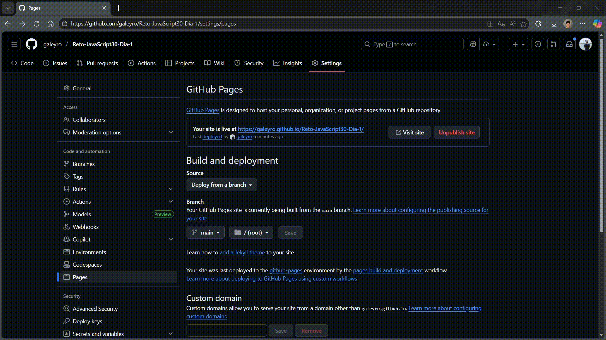

# JS Drum Kit - Reto JavaScript30 Día 1

Este proyecto es parte del reto **JavaScript30**, donde se implementa una batería virtual que reacciona a eventos del teclado. El objetivo es replicar la funcionalidad original utilizando únicamente tecnologías web estándar sin frameworks.

## Tecnologías Utilizadas
- **HTML5**: Estructura semántica.
- **CSS3**: Estilos, transiciones y efectos visuales.
- **JavaScript (Vanilla)**: Lógica de eventos y reproducción de audio.

## Solución
La funcionalidad principal se logra mediante un "Event Listener" que detecta cuando una tecla es presionada. El script busca el elemento de audio y el elemento visual (`div`) correspondientes al código de la tecla (`keyCode`).

```javascript
// Detecta el evento de teclado
window.addEventListener('keydown', playSound);

function playSound(e) {
  // Selecciona el audio y la tecla asociada
  const audio = document.querySelector(`audio[data-key="${e.keyCode}"]`);
  const key = document.querySelector(`div[data-key="${e.keyCode}"]`);
  
  if (!audio) return; // Si no hay audio asociado, no hace nada

  audio.currentTime = 0; // Reinicia el audio para permitir ejecuciones rápidas
  audio.play();
  key.classList.add('playing'); // Añade efecto visual
}
```

## Demo


## Instrucciones de Instalación
1. Clona este repositorio o descarga los archivos.
2. Abre el archivo `index.html` en tu navegador web.
3. Disfruta tocando la batería con tu teclado.

## Link del Despliegue
Puedes ver el proyecto funcionando en el siguiente enlace:
[JavaScript Drum Kit - Live Demo](https://galeyro.github.io/Reto-JavaScript30-Dia-1/)

## Autor
**Galo Guevara Torres**
